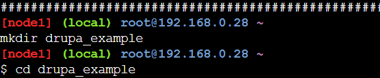
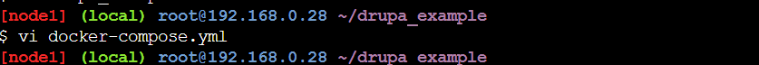
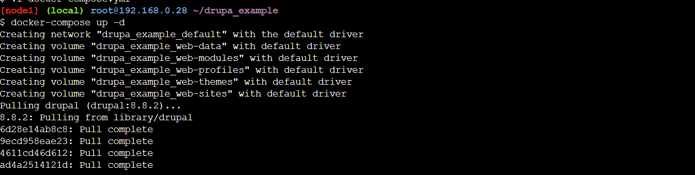
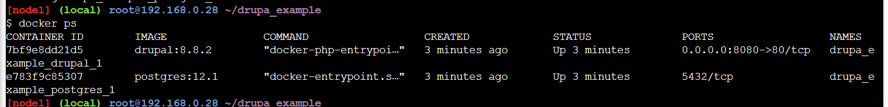
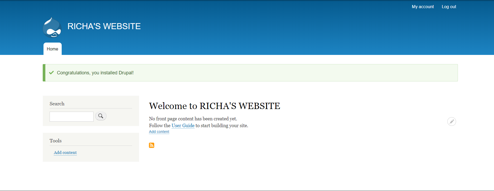

# devopsAssignment1

### creating directory


### creating compose file


### docker-compose.yml
```commandline
version: '2'

services:

  drupal:
    build: .
    ports:
      - 8080:80
    volumes:
      - web-modules:/var/www/html/modules
      - web-profiles:/var/www/html/profiles
      - web-themes:/var/www/html/themes
      - web-sites:/var/www/html/sites

  postgres:
    image: postgres:12.1
    environment:
      POSTGRES_PASSWORD: admin
    volumes:
      - web-data:/var/lib/postgresql/data

volumes:
  web-data:
  web-modules:
  web-profiles:
  web-themes:
  web-sites:
```
### Running compose file


### List the container


### drup config on port 8080




